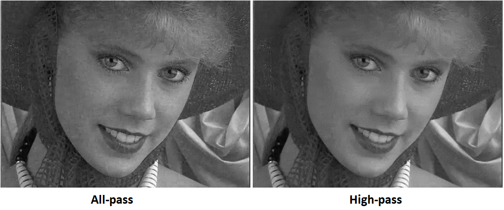

# Image Grain (Low-Frequency Noise) Removal Using White Noise Filter

This is an implementation of [LFNFilter](https://ieeexplore.ieee.org/document/8451391).
 on Python and Matlab. See also [LFNFilter](https://users.encs.concordia.ca/~amer/LFNFilter/).
LFNFilter uses existing white Gaussian noise filters (e.g., [BMCNN](https://github.com/meisamrf/Image-denoising-tensorflow-keras) or  
[CMDF](https://github.com/meisamrf/cmdf-denoiser))
 to address low-frequency component of spatially correlated noise (image grain).
Here is the block diagram of the LFNFilter.

Here is a sample denoising result using [BMCNN](https://github.com/meisamrf/Image-denoising-tensorflow-keras).

**The repository includes:**
* Todo: Python package.
* Matlab package for LFNFilter.
* Test images.
* Trained weights for BMCNN.

## Getting Started with Python (Todo)
* 

# Getting Started with Matlab (Windows only)
* [demo_LFN.m](Matlab/demo_LFN.m) Is the fastest way to start.
* [demo_LFN_real.m](Matlab/demo_LFN_real.m) demonstrates the real image grain removal.

## Installation (Python)
1. Todo